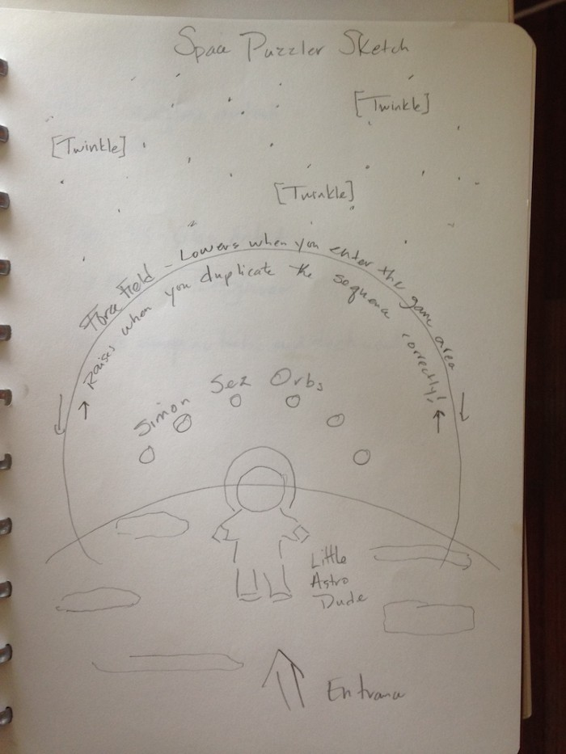
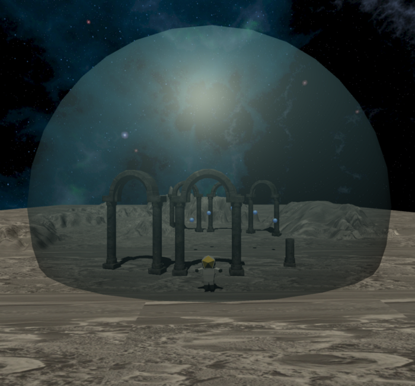

# Space Puzzler

Virtual Reality project using Unity and Google Cardboard VR Headset.

---
> Space Puzzler is a VR application similar to the classic memory game “Simon”.
The objective is to navigate through ruins on a moon surrounded by a force field and mimic the orb sequence pattern in order to exit the field.

---
## Versions
- Unity 2017.2.0f3
- Google VR Unity SDK v1.70.0
- Submitted and tested on iPhone 6

## Unity Asset Store Acquisitions
- 

## Initial Design Sketch
First step was to make a sketch depicting how I wanted to implement the environment.

## First Implementation

[Space Puzzler first](https://youtu.be/q4XCBnVzamA)

## Final Implementation

[Space Puzzler final](https://youtu.be/zuWcw-SYR04)
